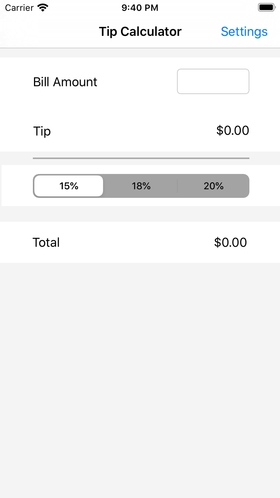

# Tip Calculator

Tip Calculator is an app that makes paying the bill simple and easy. Users will input their desired tip percentage,
and the app will display the appropriate tip and total amounts.

## Features

Tip Calculator provides a settings page, where users can customize the following features:
- Default Tip Percentage (makes it easy to calculate several bills at once)
- Dark Theme On/Off (can come in handy with sensitive eyes or dark environments)
- Music On/Off (can provide a calming, ambient environment to do calculations in)

## Design

Tip Calculator uses AVFoundation as its audio framework, UserDefaults to store the user's settings, and NCObserver along
with NotificationCenter to pass data and play/stop the background music between screens.

## Images

These screenshots show the app's main view and settings pane, with and without the dark theme turned on.

## Gif

